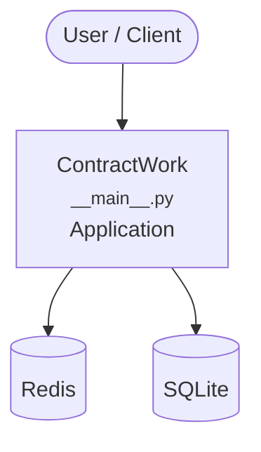

# Context Map — `ContractWork`

> Auto-generated architecture & deployment context map. Summarizes the core application, container/cloud footprint, and database connections. Regenerate after significant structural changes.

**Repo:** `avnit/ContractWork` · **Original** · Public · Primary language: Python · Default branch: `master` · Files: 458

**Description:** Class material for python finance 101

## 1. Core application

Beta Calculator

- **Entry points:** `venv/lib/python3.6/site-packages/pip/__main__.py`, `venv/lib/python3.6/site-packages/wheel/__main__.py`
- **Listens on port(s):** 80, 443, 1348

## 2. Containers & cloud applications

_No container, Kubernetes, IaC, or cloud-deploy manifests detected. Runs as a local script/library or static site._

## 3. Database connections

**Datastores in use:** Redis, SQLite

**Referenced in:**
- `venv/lib/python3.6/site-packages/pip/_vendor/lockfile/sqlitelockfile.py`

## 4. Architecture diagram

## 5. Security posture

- No open Dependabot alerts or static-scan findings recorded.

---
_Generated by repo context-mapping pass on 2026-08-13._